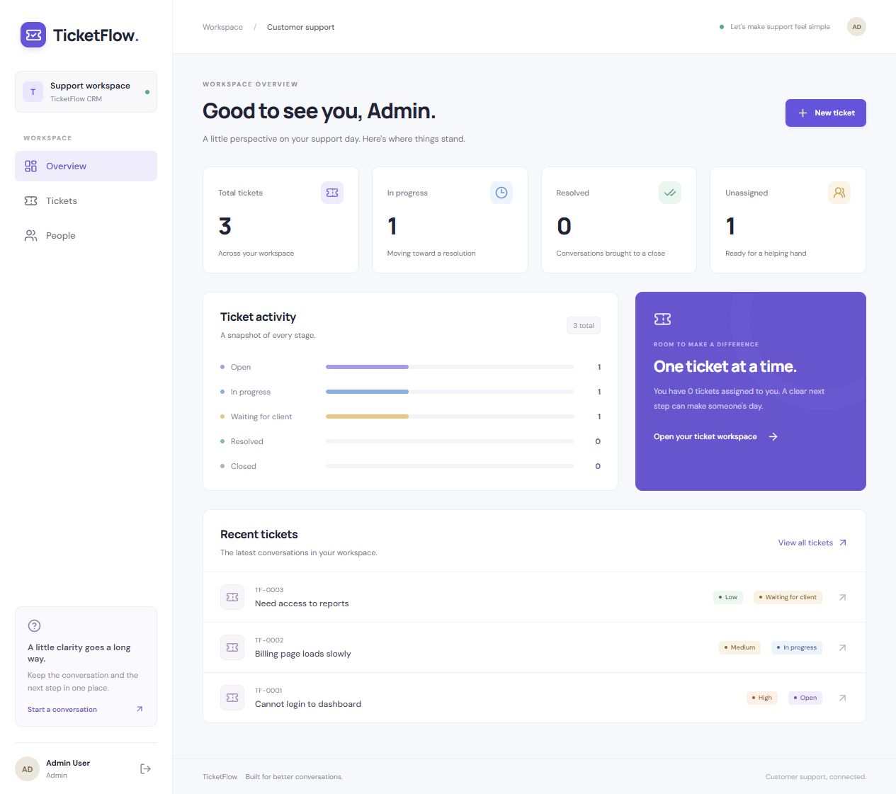
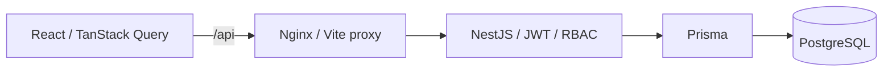

# TicketFlow CRM

Fullstack HelpDesk CRM: React + TypeScript + Vite + TanStack Query + React Hook Form + Zod; NestJS + Prisma + PostgreSQL + JWT/RBAC.

Завершений MVP для локального запуску: реєстрація та вхід, dashboard, тікети, коментарі, призначення менеджерів, пошук, фільтри, пагінація та керування користувачами. Адаптивний інтерфейс для desktop і mobile.



## Архітектура



Frontend надсилає запити через same-origin `/api`: Vite проксіює їх у розробці, Nginx — у Docker. JWT зберігається в `sessionStorage` поточної вкладки; logout очищає токен і кеш запитів. На 401 сесія завершується автоматично. Backend перевіряє актуальну роль та активність акаунта з БД на кожен захищений запит.

## Запуск у Docker

Потрібні Docker Desktop із запущеним Linux Engine та Docker Compose. З кореня репозиторію:

```powershell
docker compose up -d --build
docker compose exec backend npm run db:seed
```

Backend автоматично застосовує наявні міграції після готовності PostgreSQL. Дані зберігаються в наявному volume `postgres_data`. Seed запускається вручну, створює demo-акаунти без перезапису існуючих; якщо demo-користувач уже має тікети, вони зберігаються без дублювання. Створення demo-даних виконується транзакційно.

- **Застосунок: http://localhost:8080**
- API: http://localhost:3000
- Swagger UI: http://localhost:3000/docs
- OpenAPI JSON: http://localhost:3000/docs-json
- Перевірка БД: http://localhost:3000/health/db

```powershell
docker compose logs -f backend
docker compose stop
```

Для зовнішнього розгортання задай власний `JWT_SECRET` у середовищі або кореневому `.env`; значення Compose за замовчуванням призначене для локальної розробки. Docker image містить Prisma CLI та інструменти seed для цих команд.

## Локальний frontend

Спочатку запусти backend (нижче), потім в іншому терміналі:

```powershell
cd frontend
npm ci
npm run dev
```

Відкрий http://localhost:5173. За замовчуванням Vite проксіює `/api` до http://localhost:3000. Для іншої адреси backend встанови `API_PROXY_TARGET` перед запуском Vite. Шрифти постачаються локально в frontend bundle.

### Сторінки

- `/login`, `/register` — вхід та реєстрація з валідацією полів.
- `/` — статистика статусів, ключові показники, останні тікети.
- `/tickets` — пошук, статус, пріоритет, менеджер, пагінація. Фільтри зберігаються в URL.
- `/tickets/new` — створення тікета.
- `/tickets/:id` — опис, редагування, статус, призначення, коментарі та підтвердження видалення.
- `/users` — ADMIN: пошук користувачів, редагування профілю, ролі й активності. Власна роль та активність захищені.

## Локальний backend

Потрібні Node.js 22.12+ (або 24) та PostgreSQL 16. Можна використовувати окремо встановлену PostgreSQL, якщо Docker недоступний.

```powershell
# З кореня, якщо PostgreSQL запускається через Docker:
docker compose up -d postgres
cd backend
npm ci
# Лише якщо .env ще немає:
Copy-Item .env.example .env
npm run prisma:generate
npm run db:migrate
npm run db:seed
npm run start:dev
```

Не перезаписуй власний `.env`. `DATABASE_URL` має вказувати на доступну PostgreSQL; `JWT_SECRET` — мінімум 16 символів; `PORT` за замовчуванням 3000. JWT діє 1 день (налаштування в `auth.module.ts`). Старий `JWT_EXPIRES_IN` не використовується.

Production-запуск локальної збірки:

```powershell
npm run build
npm run start:prod
```

## Demo-акаунти

| Роль | Email | Пароль |
|---|---|---|
| ADMIN | admin@ticketflow.test | password123 |
| MANAGER | manager@ticketflow.test | password123 |
| USER | user@ticketflow.test | password123 |

Seed додає три тікети різних статусів/пріоритетів і чотири коментарі. Повторний seed не скидає паролі чи ролі існуючих акаунтів.

Приклад у PowerShell:

```powershell
$login = Invoke-RestMethod http://localhost:3000/auth/login -Method Post -ContentType 'application/json' -Body '{"email":"user@ticketflow.test","password":"password123"}'
$headers = @{ Authorization = "Bearer $($login.accessToken)" }
Invoke-RestMethod http://localhost:3000/tickets -Headers $headers
```

Або встав `accessToken` у кнопку **Authorize** в Swagger.

## Правила доступу

| Дія | ADMIN | MANAGER | USER |
|---|---|---|---|
| Список, перегляд, коментарі, статистика | Усі | Призначені собі + непризначені | Власні |
| Створення | Від себе, можна призначити активного manager | Від себе, автоматично призначений собі | Від себе, без призначення |
| Оновлення | Усі поля DTO | Статус, пріоритет, призначення собі | Назва й опис власного OPEN тікета |
| Зняття/зміна призначення | Так | Лише призначення собі | Ні |
| Видалення тікета | Так | Ні | Ні |
| Керування користувачами | Так | Ні | Ні |

Чужий невидимий тікет повертає 404. Неактивні користувачі не проходять JWT-перевірку; актуальна роль читається з БД на кожен запит. Менеджер не може змінювати назву/опис. Переданий USER `assignedToId` при створенні ігнорується відповідно до початкової поведінки. `assignedToId: null` у PATCH знімає призначення лише для ADMIN. Видалення тікета каскадно видаляє коментарі.

## API

| Метод | Endpoint | Призначення |
|---|---|---|
| POST | /auth/register | Реєстрація USER |
| POST | /auth/login | JWT + профіль |
| GET | /auth/me | Поточний профіль |
| POST | /auth/logout | Підтвердження виходу; клієнт видаляє JWT |
| GET, POST | /tickets | Список / створення |
| GET, PATCH, DELETE | /tickets/:id | Перегляд / зміна / видалення |
| GET, POST | /tickets/:id/comments | Список / додавання коментаря |
| GET | /dashboard/statistics | total, byStatus, byPriority, assignedToMe, unassigned |
| GET | /users | ADMIN: список користувачів |
| GET | /users/managers | ADMIN/MANAGER: активні менеджери |
| GET, PATCH | /users/:id | ADMIN: перегляд / зміна профілю, ролі, активності |

Logout у цьому MVP не відкликає виданий токен на сервері. Refresh tokens, blacklist, email, attachments та audit log залишені на наступний етап.

### Фільтрація і пагінація

`GET /tickets?search=login&status=OPEN&priority=HIGH&page=1&perPage=10`

- `search`: нечутливий до регістру пошук у назві й описі.
- `status`: OPEN, IN_PROGRESS, WAITING_FOR_CLIENT, RESOLVED, CLOSED.
- `priority`: LOW, MEDIUM, HIGH, URGENT.
- ADMIN: додатково `createdById`, `assignedToId`; MANAGER: `assignedToId` в межах своєї видимості. USER ці фільтри не розширюють доступ.
- `page >= 1`, `perPage` від 1 до 100. Сортування тікетів: `createdAt DESC, id DESC`.
- Результат: `{ items, meta: { total, page, perPage, lastPage } }`; `lastPage=0` для порожнього списку.
- Коментарі мають окрему пагінацію (20 за замовчуванням), порядок `createdAt ASC, id ASC`. Деталі тікета також повертають коментарі для сумісності з початковим API.
- `/users` підтримує `search`, `role`, `page`, `perPage`.

## Перевірки

Frontend (`frontend`):

```powershell
npm run build
npm run lint
npm test
```

GitHub Actions (`.github/workflows/ci.yml`) запускає перевірки обох частин, збірку Compose, міграції, повторний seed і API smoke. Workflow додано до репозиторію; він виконається після push.

У `backend`:

```powershell
npm run prisma:generate
npx prisma validate
npm run build
npx tsc --noEmit
npm run lint
npm test -- --runInBand
npm run test:e2e -- --runInBand
```

Unit-тести перевіряють RBAC, призначення, коментарі, статистику, auth і захист адміністратора від самодеактивації. HTTP-тести піднімають Nest із реальними guards/DTO/services та підставною БД; PostgreSQL їм не потрібна.

Для живої БД після запуску backend та seed:

```powershell
npm run test:smoke
```

Smoke входить під трьома demo-ролями, створює тимчасові тікети, перевіряє CRUD/RBAC/comments/assignment/filtering/dashboard/Swagger й видаляє створені тікети у `finally`. `API_URL` змінює адресу API, `SEED_PASSWORD` — пароль demo-акаунтів. Використовуй локальну demo-базу.

З кореня: `docker compose config --quiet` перевіряє Compose без Docker Engine. Для повної перевірки контейнерів потрібен робочий Docker Desktop. Помилка `dockerInference` виникає під час запуску Docker Desktop, до запуску контейнерів TicketFlow.

## Структура

`backend/src/auth` — JWT та ролі; `users` — користувачі; `tickets` — тікети, коментарі та політики доступу; `dashboard` — endpoint статистики, який повторно використовує політику TicketsService. `prisma` — схема, міграції, seed. `setup-app.ts` — спільна валідація, обробка помилок Prisma та Swagger.

## Межі MVP

Redis/BullMQ, email jobs, file uploads, audit logs, refresh tokens та відкликання JWT — окремий наступний етап. Вони не потрібні для завершеного MVP. Поточні тести вже входять до проєкту.

Для публічного production-розгортання потрібні HTTPS, власні секрети, резервні копії БД та обмеження доступу до портів PostgreSQL/API. Demo-акаунти й локальні паролі призначені для демонстрації.

Результати перевірок і відтворення сценаріїв: [Verification report](docs/verification.md).
